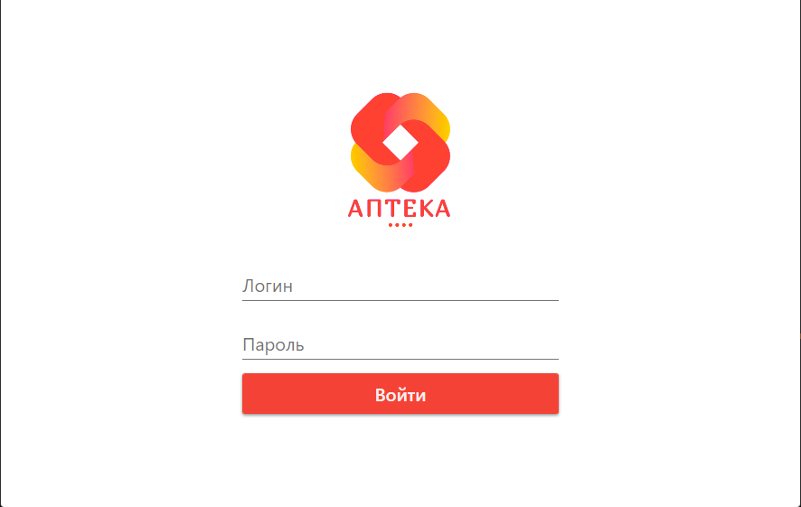

# Информационная система складского учета медицинской аптеки

Данный проект представляет собой программное приложение на WPF, предназначенное для управления складом медицинской аптеки. Программа работает на платформе [платформа] и использует SQLite в качестве базы данных для хранения информации. Это приложение является курсовой работой по дисциплине "Разработка программных модулей".

### Набор функций:
- Несколько ролей для пользователей.
- Управление текущими запасами, включая текущий запас / количество.
- Разделение товара на разные категории.
- Сканирование товаров с помощью сканера штрих-кодов, чтобы быстро отмечать приход товара.
- Дополнительных экран для продажи товаров с помощью сканера штрих-кодов.
- Создание Word-файлов с текущими ценами для печати.
- Отправка уведомлений о создании, редактировании, удалении, а также всего списка товаров / персонала в чат приложения Telegram.
- Отправка товарного чека на электронную почту.


# Первый вход в систему

После установки приложения базы данных будут пустыми. Для первоначального входа используйте следующие учетные данные:
- *Логин*: `adminSaveLogin`
- *Пароль*: `adminSavePassword`

Обратите внимание, что данный логин и пароль являются статичными и не подлежат изменению. Это сделано для обеспечения постоянного доступа к системе.

# Отправка уведомлений

Для отправки уведомлений в Telegram выполните следующие шаги:

1. Создайть бота через [@BotFather](https://t.me/botfather) или любым другим удобным способом.
2. Откройть файл `TgMessage.cs`, расположенный по пути: `..InventoryPharmacyViewTgMessage.cs`.
3. Вставить токен вашего бота и ID чата, куда будут отправляться уведомления:
```C#
var token = "Токен бота";
var chatId = "ID чата, куда будут приходить уведомления";
...
```

Для отправки уведомлений на электроную почту:
1. Откройть файл `EmailMessage.cs` по адресу: `..InventoryPharmacyViewEmailMessage.cs`.
2. Указать вашу электронную почту, почту бота, его пароль и название:
``` C#
string myEmail = "Ваша_почта@nke.ru";
string emailBotLog = "Почта_бота@nke.ru";
string emailBotPas = "Пароль_бота";
string emailBotName = "Название_или_Имя";
...
```
[Подробнее про отправку сообщений Email](https://www.youtube.com/watch?v=pN66IETYU8k&t=130s)

[Подробнее про пароль Email для бота](https://www.youtube.com/watch?v=BFTCVC33qhQ&t=374s)

# Скриншоты



# Лицензия
Лицензия MIT. Спасибо за использование программного обеспечения!
