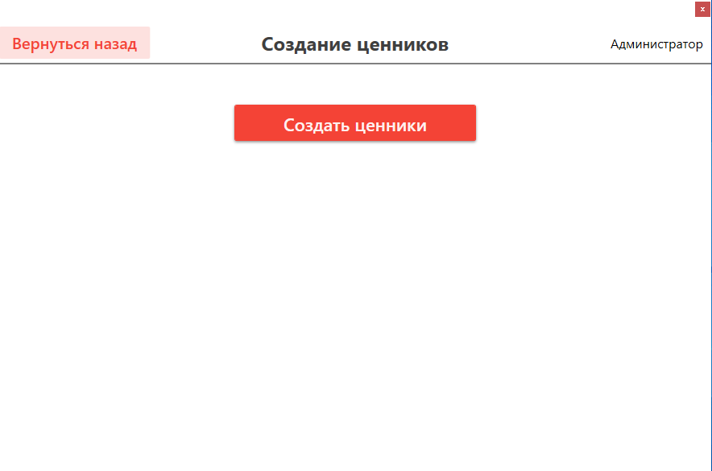

# Inventory Management System for a Medical Pharmacy

This project is a WPF-based software application designed to manage the inventory of a medical pharmacy. The program runs on the platform platform and uses SQLite as its database to store information. This application serves as a coursework for the subject "Software Module Development."

### Feature Set:
- Multiple user roles.
- Management of current stock levels, including real-time quantity tracking.
- Categorization of products into different categories.
- Product scanning using barcode scanners to quickly record incoming items.
- Additional screens for selling products with barcode scanner integration.
- Generation of Word files containing current prices for printing purposes.
- Sending notifications about creation, editing, deletion, and full lists of products/personnel to the Telegram app chat.
- Emailing product receipts to customers.

# Initial Login

Upon installation, the database will be empty. For the initial login, use the following credentials:
- *Username*: `adminSaveLogin`
- *Password*: `adminSavePassword`

Note that these credentials are static and cannot be changed. This measure ensures constant access to the system.

# Notification Delivery

To set up Telegram notifications, follow these steps:

1. Create a bot through @BotFather or any other convenient method.
2. Open the file `TgMessage.cs`, located at: `..InventoryPharmacyView\TgMessage.cs`.
3. Insert your bot's token and the chat ID where you want to receive notifications:
```C#
var token = "Your Bot Token";
var chatId = "Chat ID for receiving notifications";
...
```

For sending notifications via email:
1. Open the file `EmailMessage.cs` at: `..InventoryPharmacyView\EmailMessage.cs`.
2. Specify your email address, the bot's email, password, and display name:
``` C#
string myEmail = "your_email@nke.ru";
string emailBotLog = "bot_email@nke.ru";
string emailBotPas = "Bot Password";
string emailBotName = "Display Name";
...
```
[More details on sending email messages](https://www.youtube.com/watch?v=pN66IETYU8k&t=130s)

[More about setting an email password for the bot](https://www.youtube.com/watch?v=BFTCVC33qhQ&t=374s)

# Screenshots





# Possible Improvements:
- Adding settings to choose color themes, languages, and other parameters.
- Enhancing price tag functionality (adjust paper size, number of columns, etc.).
- Creating reporting features.
- Developing online ordering capabilities.
- Improving code quality and implementing the MVVM pattern.
- Refining user roles by selecting specific functions each user can perform.

# License
MIT License. Thank you for using this software!
